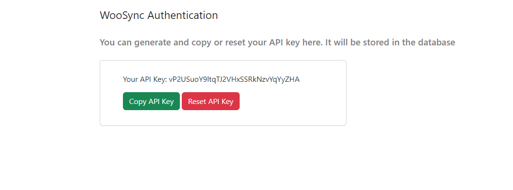

# Installálás

## A WooSync bővítmény installálása

Töltsük le a bővítményt a bal oldalsó sávban lévő WooSync linkről. Töltsük fel új bővítményként a WordPress weboldalunkra. Aktiváljuk, majd generáljunk egy api kulcsot a bővítmény "Authentication" menüpontja alatt. A generált API kulcsot és a weboldalunk címét illeszük be a ProductBridge first startup oldalon lévő azonos nevű mezőibe, és már meg is történt az autentikáció

<!--  -->

